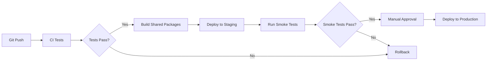

# EasyMO Deployment Architecture

## Overview

EasyMO uses a multi-platform deployment strategy optimized for different components:

```
┌─────────────────────────────────────────────────────────────────┐
│                    PRODUCTION ARCHITECTURE                      │
├─────────────────────────────────────────────────────────────────┤
│                                                                 │
│  ┌──────────────┐  ┌──────────────┐  ┌──────────────┐          │
│  │   Netlify    │  │   Supabase   │  │  Cloud Run   │          │
│  │  (Frontend)  │  │    (Edge)    │  │  (Services)  │          │
│  └──────────────┘  └──────────────┘  └──────────────┘          │
│         │                 │                  │                  │
│         ▼                 ▼                  ▼                  │
│  ┌──────────────┐  ┌──────────────┐  ┌──────────────┐          │
│  │  admin-app   │  │  80+ Edge    │  │ wallet-svc   │          │
│  │  waiter-pwa  │  │  Functions   │  │ agent-core   │          │
│  │ real-est-pwa │  │              │  │ broker-orch  │          │
│  └──────────────┘  └──────────────┘  └──────────────┘          │
│                                                                 │
│  ┌─────────────────────────────────────────────────────────┐   │
│  │              Supabase PostgreSQL Database               │   │
│  │  (Shared by Edge Functions + Cloud Run Services)       │   │
│  └─────────────────────────────────────────────────────────┘   │
│                                                                 │
│  ┌─────────────────────────────────────────────────────────┐   │
│  │     Redis (Upstash) + Kafka (Confluent Cloud)          │   │
│  │  (Message Queue + Caching)                              │   │
│  └─────────────────────────────────────────────────────────┘   │
└─────────────────────────────────────────────────────────────────┘
```

## Platform Usage

| Platform             | Components                                              | Purpose                      | Managed By                |
| -------------------- | ------------------------------------------------------- | ---------------------------- | ------------------------- |
| **Netlify**          | admin-app, waiter-pwa, real-estate-pwa, bar-manager-app | Frontend hosting, CDN, SSL   | Auto-deploy from `main`   |
| **Supabase**         | Edge Functions (80+), PostgreSQL, Auth, Storage         | Serverless backend, database | Manual via CLI            |
| **Google Cloud Run** | NestJS microservices (12+)                              | Stateless container services | CI/CD via cloudbuild.yaml |
| **Upstash Redis**    | Cache, rate limiting, session                           | Managed Redis                | Terraform                 |
| **Confluent Cloud**  | Kafka topics, event streaming                           | Message broker               | Terraform                 |

## Deployment Targets

### 1. Frontend Apps → Netlify

**Apps:**

- `admin-app/` - Next.js 15 admin dashboard
- `waiter-pwa/` - PWA for waiters
- `real-estate-pwa/` - Property management PWA
- `bar-manager-app/` - Bar management interface

**Build Command:**

```bash
pnpm run build:deps && cd admin-app && pnpm build
```

**Deploy:**

```bash
# Automatic on git push to main
git push origin main

# Manual deploy
netlify deploy --prod --dir=admin-app/.next
```

**Environment Variables:**

- `NEXT_PUBLIC_SUPABASE_URL`
- `NEXT_PUBLIC_SUPABASE_ANON_KEY`
- No server secrets allowed (enforced by prebuild)

### 2. Edge Functions → Supabase

**Functions:**

- `wa-webhook-*` - WhatsApp webhook handlers (8 functions)
- `admin-*` - Admin API endpoints (5 functions)
- `agents/*` - AI agent endpoints (6 agents)
- `momo-webhook` - Mobile money webhook
- `revolut-webhook` - Revolut payment webhook
- `business-lookup`, `bars-lookup` - Public APIs
- 60+ more specialized functions

**Deploy:**

```bash
# Deploy all functions
pnpm run functions:deploy

# Deploy specific category
pnpm run functions:deploy:wa

# Deploy single function
supabase functions deploy wa-webhook-core
```

**Environment Secrets:**

```bash
supabase secrets set OPENAI_API_KEY=xxx
supabase secrets set ANTHROPIC_API_KEY=xxx
supabase secrets set WHATSAPP_VERIFY_TOKEN=xxx
```

### 3. Microservices → Google Cloud Run

**Services:**

- `wallet-service` - Financial transactions
- `agent-core` - AI agent orchestration
- `broker-orchestrator` - Message routing
- `attribution-service` - Analytics attribution
- `buyer-service` - Buyer management
- `ranking-service` - Content ranking
- `vendor-service` - Vendor management
- `video-orchestrator` - Video calls
- `voice-bridge` - Voice call handling
- `wa-webhook-ai-agents` - WhatsApp AI
- `whatsapp-pricing-server` - Pricing engine
- `whatsapp-webhook-worker` - Async webhook processing

**Build & Deploy:**

```bash
# Using Cloud Build
gcloud builds submit --config cloudbuild.yaml \
  --substitutions=_SERVICE_NAME=wallet-service

# Or via deployment script
./scripts/deploy/services.sh --env production
```

**Container Registry:** `gcr.io/easymo-prod/`

## Environment Stages

### Development (Local)

```bash
# Start Supabase locally
supabase start

# Start services with Docker Compose
docker compose -f docker-compose.agent-core.yml up

# Run frontend dev server
pnpm dev
```

**URLs:**

- Frontend: http://localhost:3000
- Supabase Studio: http://localhost:54323
- Services: http://localhost:3001-3010

### Staging

**Domain:** `staging.easymo.app`

**Deploy:**

```bash
./scripts/deploy/all.sh --env staging
```

**Database:** Supabase project `easymo-staging`

### Production

**Domain:** `easymo.app`

**Deploy:**

```bash
./scripts/deploy/all.sh --env production
```

**Database:** Supabase project `easymo-prod`

## CI/CD Pipeline

### GitHub Actions Workflows

| Workflow              | Trigger         | Purpose                   |
| --------------------- | --------------- | ------------------------- |
| `ci.yml`              | Push to main    | Lint, test, type-check    |
| `admin-app-ci.yml`    | PR to admin-app | Admin app specific checks |
| `supabase-deploy.yml` | Manual          | Deploy edge functions     |
| `lighthouse.yml`      | PR to frontends | Performance audit         |
| `additive-guard.yml`  | PR              | Prevent migration edits   |
| `ci-secret-guard.yml` | All PRs         | Secret scanning           |

### Deployment Flow



## Configuration Files

| File                            | Purpose                      |
| ------------------------------- | ---------------------------- |
| `netlify.toml`                  | Netlify build configuration  |
| `cloudbuild.yaml`               | GCP Cloud Build for services |
| `supabase/config.toml`          | Supabase project settings    |
| `docker-compose.agent-core.yml` | Local dev environment        |
| `Dockerfile`                    | Container image for services |

## Secrets Management

**Supabase Secrets** (for Edge Functions):

```bash
supabase secrets set KEY=value --project-ref xxx
supabase secrets list
```

**Cloud Run Secrets** (for Services):

```bash
gcloud secrets create SECRET_NAME --data-file=-
echo "secret-value" | gcloud secrets create SECRET_NAME --data-file=-
```

**GitHub Secrets** (for CI/CD):

- `SUPABASE_ACCESS_TOKEN`
- `NETLIFY_AUTH_TOKEN`
- `GCP_SERVICE_ACCOUNT_KEY`

## Monitoring & Observability

- **Sentry:** Error tracking for all platforms
- **Supabase Logs:** Edge function logs
- **Cloud Run Logs:** Service logs via Stackdriver
- **Uptime Monitoring:** Health check endpoints

## Rollback Procedures

### Edge Functions

```bash
# List deployments
supabase functions list --project-ref xxx

# Rollback specific function
supabase functions deploy wa-webhook-core --version v1.2.3
```

### Cloud Run Services

```bash
# List revisions
gcloud run revisions list --service wallet-service

# Rollback to previous revision
gcloud run services update-traffic wallet-service \
  --to-revisions=wallet-service-v123=100
```

### Frontend (Netlify)

```bash
# Via Netlify UI: Deploys > [Previous Deploy] > Publish Deploy
netlify deploy --alias rollback-$(date +%s)
```

## Troubleshooting

### Issue: Build Fails

```bash
# Clean and rebuild
pnpm clean
pnpm install --frozen-lockfile
pnpm run build:deps
pnpm build
```

### Issue: Migration Fails

```bash
# Check current status
supabase db diff --linked

# Reset local database
supabase db reset

# Apply migrations
supabase db push --linked
```

### Issue: Service Won't Start

```bash
# Check service logs
gcloud run services logs read wallet-service --limit=50

# Check health endpoint
curl https://wallet-service-xxx.run.app/health
```

## Cost Optimization

- **Netlify:** Free tier for frontends
- **Supabase:** Pro plan ($25/mo) - includes 500K edge function invocations
- **Cloud Run:** Pay-per-request, autoscale to zero
- **Redis:** Upstash free tier (10K requests/day)
- **Kafka:** Confluent Cloud basic cluster (~$100/mo)

**Estimated Monthly Cost:** $150-$250 for staging + production
