# Farmer AI - USSD Payment System Implementation

**Date**: 2025-11-27  
**Status**: ✅ **IMPLEMENTED**  
**Priority**: P0 - Critical for Production

---

## 🎯 Overview

USSD Mobile Money is the **PRIMARY AND ONLY** payment method for all farmer produce transactions on easyMO. This implementation provides:

- ✅ Clickable `tel:` links for automatic USSD dialing
- ✅ MTN Mobile Money integration (*182*8*1*AMOUNT#)
- ✅ Payment tracking and confirmation
- ✅ Bilingual support (English/Kinyarwanda)
- ✅ 30-minute payment expiry
- ✅ Automatic farmer notifications

---

## 📦 Components Implemented

### 1. USSD Payment Service
**File**: `packages/agents/src/tools/ussd-payment.ts`

**Features**:
- Generate USSD codes for any amount
- Create clickable tel: links
- Store pending payments
- Confirm payments with reference numbers
- Notify farmers of successful payments
- Handle payment expiry

**Usage**:
```typescript
const paymentService = new USSDPaymentService();

// Initiate payment
const payment = await paymentService.initiateProducePayment({
  buyerPhone: '+250788123456',
  farmerPhone: '+250788767816',
  amount: 15000,
  listingId: 'uuid',
  commodity: 'Maize',
  quantity: 50,
  unit: 'kg'
});

// Returns:
// {
//   ussdCode: '*182*8*1*15000#',
//   telLink: 'tel:*182*8*1*15000%23',
//   instructions: 'Formatted WhatsApp message',
//   paymentId: 'uuid',
//   expiresAt: '2025-11-27T14:30:00Z'
// }
```

### 2. Database Schema
**File**: `supabase/migrations/20251127140000_farmer_ussd_payments.sql`

**Tables**:
```sql
CREATE TABLE farmer_payments (
  id UUID PRIMARY KEY,
  listing_id UUID REFERENCES farmer_listings(id),
  buyer_phone TEXT NOT NULL,
  farmer_phone TEXT NOT NULL,
  amount NUMERIC NOT NULL CHECK (amount > 0),
  ussd_code TEXT NOT NULL,
  payment_reference TEXT,  -- Buyer provides after payment
  status TEXT CHECK (status IN ('pending', 'initiated', 'completed', 'failed', 'expired')),
  expires_at TIMESTAMPTZ NOT NULL,
  created_at TIMESTAMPTZ DEFAULT NOW(),
  completed_at TIMESTAMPTZ
);
```

**Functions**:
- `get_farmer_payment_summary(phone)` - Get earnings stats
- `expire_pending_payments()` - Auto-expire old payments
- `confirm_farmer_payment(id, ref, phone)` - Confirm payment
- `get_listing_payments(listing_id)` - Get payment history

### 3. Farmer Agent Integration
**File**: `supabase/functions/wa-webhook-ai-agents/ai-agents/farmer_agent.ts`

**New Tools**:

#### `initiate_ussd_payment`
Generates USSD payment for a produce transaction.

**Parameters**:
```typescript
{
  buyer_phone: string,      // Buyer's phone (+250...)
  farmer_phone: string,     // Farmer's phone
  listing_id: string,       // Listing UUID
  commodity: string,        // 'Maize', 'Beans', etc.
  quantity: number,         // 50
  unit: string,            // 'kg', 'bag', etc.
  price_per_unit: number   // Price in RWF
}
```

**Returns**:
```typescript
{
  success: true,
  payment_id: 'uuid',
  total_amount: 15000,
  ussd_code: '*182*8*1*15000#',
  tel_link: 'tel:*182*8*1*15000%23',
  message: 'Formatted WhatsApp message with clickable link',
  expires_in_minutes: 30
}
```

#### `confirm_payment`
Confirms payment after buyer dials USSD and gets reference.

**Parameters**:
```typescript
{
  payment_id: string,    // From initiate_ussd_payment
  reference: string,     // MTN reference (e.g., 'MP123456')
  buyer_phone: string   // For verification
}
```

**Returns**:
```typescript
{
  success: true,
  message: 'Payment confirmed! Farmer notified.',
  amount: 15000,
  farmer_phone: '+250788767816'
}
```

---

## 🔄 Payment Flow

### User Journey

```
1. Buyer finds produce listing
   ↓
2. AI Agent shows listing with price
   ↓
3. Buyer confirms purchase
   ↓
4. AI calls initiate_ussd_payment()
   ↓
5. Buyer receives clickable tel: link
   📱 "Click to pay: tel:*182*8*1*15000#"
   ↓
6. Buyer clicks link (auto-dials USSD)
   OR manually dials *182*8*1*15000#
   ↓
7. MTN prompt appears: "Enter PIN to pay 15,000 RWF"
   ↓
8. Buyer enters PIN and confirms
   ↓
9. MTN sends SMS with reference: "MP123456"
   ↓
10. Buyer replies to AI: "PAID MP123456"
    ↓
11. AI calls confirm_payment()
    ↓
12. Payment status → 'completed'
    ↓
13. Farmer receives WhatsApp notification:
    "✅ Payment received! 15,000 RWF from +250788123456"
    ↓
14. Buyer and farmer arrange pickup/delivery
```

### Technical Flow

```mermaid
sequenceDiagram
    Buyer->>AI Agent: Want to buy 50kg maize
    AI Agent->>DB: Create pending payment
    DB-->>AI Agent: payment_id
    AI Agent->>Buyer: Click: tel:*182*8*1*15000#
    Buyer->>MTN: Dials USSD code
    MTN->>Buyer: Enter PIN
    Buyer->>MTN: [PIN + Confirm]
    MTN-->>Buyer: SMS: "Payment successful. Ref: MP123456"
    Buyer->>AI Agent: PAID MP123456
    AI Agent->>DB: confirm_farmer_payment()
    DB-->>AI Agent: Success
    AI Agent->>Farmer: ✅ Payment received!
    AI Agent->>Buyer: ✅ Confirmed! Farmer notified.
```



---

## 💬 WhatsApp Message Examples

### Payment Initiation Message

```
🌾 *Payment for Maize*

📦 50 kg @ 300 RWF/kg
💰 Total: 15,000 RWF

*Click to pay via MTN Mobile Money:*
tel:*182*8*1*15000#

Or manually dial: *182*8*1*15000#

*Kinyarwanda:*
Kanda: tel:*182*8*1*15000#
Cyangwa kanda: *182*8*1*15000#

⏱️ Payment expires in 30 minutes
After payment, reply: PAID [reference number]
```

### Payment Confirmation (Buyer)

```
✅ Payment confirmed! Farmer has been notified. 
You will be contacted for pickup/delivery arrangements.

💰 Amount: 15,000 RWF
📝 Reference: MP123456
👨‍🌾 Farmer: +250788767816
```

### Payment Notification (Farmer)

```
✅ *Payment Received!*

💰 15,000 RWF
📱 Buyer: +250788123456
📝 Reference: MP123456

*Kinyarwanda:*
✅ Amafaranga yashyizwe!
💰 15,000 RWF

Next: Prepare produce for pickup/delivery
```

---

## 🛠️ USSD Codes by Operator

### MTN Mobile Money (Primary)
```
Format: *182*8*1*AMOUNT#
Example: *182*8*1*15000#

Steps:
1. Dial *182*8*1*15000#
2. Select "Send Money"
3. Enter recipient number
4. Confirm amount
5. Enter PIN
6. Receive SMS confirmation
```

### Airtel Money (Alternative)
```
Format: *500*1*1*AMOUNT#
Example: *500*1*1*15000#
```

### Tigo Cash (Alternative)
```
Format: *150*00*AMOUNT#
Example: *150*00*15000#
```

---

## 🔍 Database Queries

### Check Pending Payments
```sql
SELECT 
  p.id,
  p.buyer_phone,
  p.farmer_phone,
  p.amount,
  p.ussd_code,
  p.status,
  p.expires_at,
  l.commodity,
  l.quantity,
  l.unit
FROM farmer_payments p
LEFT JOIN farmer_listings l ON l.id = p.listing_id
WHERE p.status = 'pending'
  AND p.expires_at > NOW()
ORDER BY p.created_at DESC;
```

### Farmer Earnings Summary
```sql
SELECT * FROM get_farmer_payment_summary('+250788767816');

-- Returns:
-- total_earnings | completed_count | pending_count | total_transactions | avg_transaction
-- 125000        | 15              | 2             | 17                 | 8333
```

### Expire Old Payments (Cron Job)
```sql
SELECT expire_pending_payments();

-- Returns number of expired payments
```

### Payment History for Listing
```sql
SELECT * FROM get_listing_payments('listing-uuid');
```

---

## 🧪 Testing

### Test Payment Flow

```bash
# 1. Create test listing
curl -X POST https://your-api/listings \
  -d '{
    "farmer_phone": "+250788767816",
    "commodity": "Maize",
    "quantity": 50,
    "unit": "kg",
    "price_per_unit": 300
  }'

# 2. Initiate payment (via AI agent)
# User message: "I want to buy the maize"
# AI generates: tel:*182*8*1*15000#

# 3. Simulate payment (manual)
# Dial USSD code on test phone
# Get reference: MP123456

# 4. Confirm payment (via AI agent)
# User message: "PAID MP123456"
# AI confirms and notifies farmer
```

### Test Queries

```sql
-- Insert test payment
INSERT INTO farmer_payments (
  listing_id, buyer_phone, farmer_phone, amount, ussd_code, status, expires_at
) VALUES (
  'test-listing-id',
  '+250788123456',
  '+250788767816',
  15000,
  '*182*8*1*15000#',
  'pending',
  NOW() + INTERVAL '30 minutes'
);

-- Confirm test payment
SELECT confirm_farmer_payment(
  'payment-id'::UUID,
  'MP123456',
  '+250788123456'
);
```

---

## 📊 Analytics & Monitoring

### Key Metrics

```sql
-- Payment success rate (last 24h)
SELECT 
  status,
  COUNT(*) as count,
  ROUND(100.0 * COUNT(*) / SUM(COUNT(*)) OVER(), 2) as percentage
FROM farmer_payments
WHERE created_at > NOW() - INTERVAL '24 hours'
GROUP BY status;

-- Average payment amount
SELECT 
  AVG(amount) as avg_payment,
  MIN(amount) as min_payment,
  MAX(amount) as max_payment,
  COUNT(*) as total_payments
FROM farmer_payments
WHERE status = 'completed'
  AND created_at > NOW() - INTERVAL '7 days';

-- Top earning farmers
SELECT 
  farmer_phone,
  COUNT(*) as sales_count,
  SUM(amount) as total_earnings,
  AVG(amount) as avg_sale
FROM farmer_payments
WHERE status = 'completed'
GROUP BY farmer_phone
ORDER BY total_earnings DESC
LIMIT 10;
```

---

## ⚙️ Configuration

### Environment Variables

```bash
SUPABASE_URL=https://your-project.supabase.co
SUPABASE_SERVICE_ROLE_KEY=your-service-role-key

# Optional: For future MTN API integration
MTN_MOMO_API_KEY=your-mtn-api-key
MTN_MOMO_API_SECRET=your-secret
```

---

## 🚀 Deployment

### Apply Migration

```bash
cd /Users/jeanbosco/workspace/easymo-

# Apply USSD payment migration
supabase db push

# Or manually
psql $DATABASE_URL -f supabase/migrations/20251127140000_farmer_ussd_payments.sql
```

### Deploy Edge Function

```bash
# Deploy updated farmer agent with USSD tools
supabase functions deploy wa-webhook-ai-agents
```

### Verify Deployment

```bash
# Check table exists
psql $DATABASE_URL -c "\d farmer_payments"

# Check functions exist
psql $DATABASE_URL -c "\df get_farmer_payment_summary"
psql $DATABASE_URL -c "\df confirm_farmer_payment"

# Test payment creation
psql $DATABASE_URL -c "SELECT * FROM farmer_payments WHERE status = 'pending';"
```

---

## 🎯 Success Criteria

- [x] USSD payment generation working
- [x] `tel:` links clickable in WhatsApp
- [x] Payment tracking in database
- [x] Payment confirmation with reference
- [x] Farmer notifications working
- [x] Payment expiry (30 minutes)
- [x] Bilingual messages (EN/RW)
- [x] AI agent tools integrated

---

## 📝 Next Steps

### Phase 2 Enhancements (Future)

1. **MTN API Integration** - Automatic payment verification
2. **Multi-operator Support** - Airtel, Tigo auto-detection
3. **Payment Reminders** - SMS reminders before expiry
4. **Escrow System** - Hold payment until delivery confirmed
5. **Dispute Resolution** - Handle payment issues
6. **Analytics Dashboard** - Payment trends, farmer earnings

---

## 🆘 Troubleshooting

### Payment Not Created

**Issue**: Payment doesn't appear in database  
**Check**:
```sql
-- Check table exists
SELECT COUNT(*) FROM farmer_payments;

-- Check RLS policies
SELECT * FROM pg_policies WHERE tablename = 'farmer_payments';
```

### tel: Link Not Working

**Issue**: Clicking link doesn't dial  
**Solution**: Ensure proper URL encoding:
```typescript
const ussdCode = '*182*8*1*15000#';
const telLink = `tel:${encodeURIComponent(ussdCode)}`;
// Result: tel:*182*8*1*15000%23
```

### Payment Expired

**Issue**: Payment expired before confirmation  
**Solution**: Run expiry function:
```sql
SELECT expire_pending_payments();
```

---

## 📞 Support

**Technical Lead**: Platform Team  
**Payment Issues**: MTN Customer Service: 100  
**Documentation**: This file + inline code comments

---

**Status**: ✅ **PRODUCTION READY**  
**Last Updated**: 2025-11-27  
**Version**: 1.0
