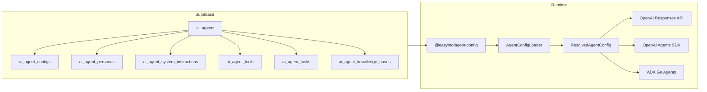

# Config-Driven AI Agents

All easyMO AI agents are **config-driven from Supabase**. No agent configs, personas, prompts, or
tools are hardcoded in code.

## Architecture



## Adding a New Agent

1. **Insert into `ai_agents`**:

```sql
INSERT INTO ai_agents (slug, name, description, default_language)
VALUES ('my-agent', 'My Agent', 'Description here', 'en');
```

2. **Add persona** (`ai_agent_personas`):

```sql
INSERT INTO ai_agent_personas (agent_id, code, role_name, tone_style, is_default)
VALUES ((SELECT id FROM ai_agents WHERE slug = 'my-agent'),
        'default', 'Helpful Assistant', 'professional', true);
```

3. **Add system instructions** (`ai_agent_system_instructions`):

```sql
INSERT INTO ai_agent_system_instructions (agent_id, code, title, instructions, is_active)
VALUES ((SELECT id FROM ai_agents WHERE slug = 'my-agent'),
        'main', 'Main Instructions', 'You are a helpful assistant...', true);
```

4. **Add tools** (`ai_agent_tools`):

```sql
INSERT INTO ai_agent_tools (agent_id, name, display_name, tool_type, description, input_schema, is_active)
VALUES ((SELECT id FROM ai_agents WHERE slug = 'my-agent'),
        'search_listings', 'Search Listings', 'db',
        'Search available listings',
        '{"type": "object", "properties": {"query": {"type": "string"}}}',
        true);
```

## Using in Code

```typescript
import {
  getAgentBySlugOrId,
  buildOpenAITools,
  createConversationMetrics,
} from "@easymo/agent-config";
import { createClient } from "@supabase/supabase-js";

const supabase = createClient(SUPABASE_URL, SUPABASE_KEY);

// Load agent config
const agent = await getAgentBySlugOrId(supabase, "jobs");

// Build OpenAI-compatible tools
const tools = buildOpenAITools(agent.tools);

// Create metrics tracker
const metrics = createConversationMetrics(supabase, {
  agentId: agent.agent.id,
  channel: "whatsapp",
});

// Use in OpenAI call
const response = await openai.chat.completions.create({
  model: agent.config?.config.model || "gpt-4o",
  messages: [
    { role: "system", content: agent.systemInstructions[0]?.instructions },
    { role: "user", content: userMessage },
  ],
  tools,
  temperature: agent.config?.config.temperature || 0.7,
});

// Record metrics
metrics.addTokens(response.usage);
await metrics.finish(true);
```

## Key Tables

| Table                          | Purpose                                      |
| ------------------------------ | -------------------------------------------- |
| `ai_agents`                    | Base agent definition (slug, name, defaults) |
| `ai_agent_configs`             | Model params (temperature, max_tokens)       |
| `ai_agent_personas`            | Character, tone, languages                   |
| `ai_agent_system_instructions` | Prompts and guardrails                       |
| `ai_agent_tools`               | Function definitions                         |
| `ai_agent_tasks`               | Workflows and capabilities                   |
| `ai_agent_knowledge_bases`     | RAG sources                                  |
| `ai_agent_intents`             | Routing and classification                   |

## Telemetry Tables

| Table                      | Purpose                                      |
| -------------------------- | -------------------------------------------- |
| `ai_agent_metrics`         | Interaction metrics (tokens, duration, cost) |
| `ai_agent_tool_executions` | Individual tool calls                        |
| `ai_agent_match_events`    | Agent-generated matches                      |

## Experiments

A/B testing is supported via:

- `ai_agent_instruction_experiments` - Test different prompts
- `ai_agent_experiment_variants` - Define variants with weights
- `ai_agent_experiment_results` - Track outcomes

## Caching

Agent configs are cached in-memory for 60 seconds. Use `clearAgentCache()` to invalidate.
