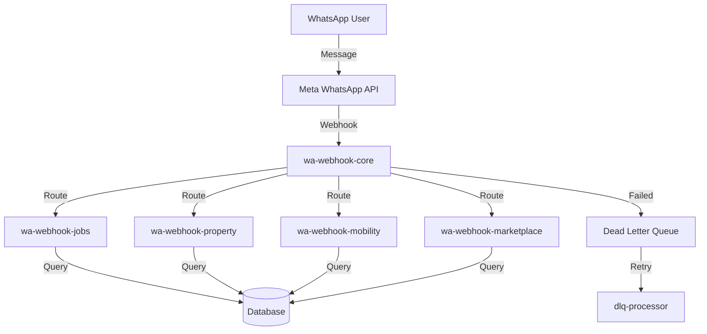
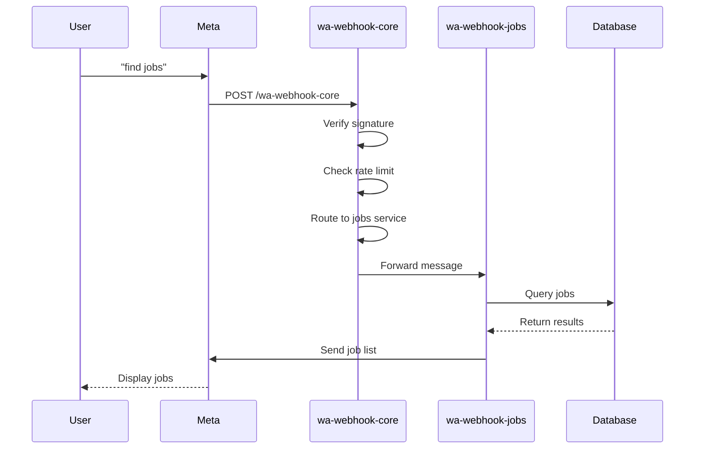
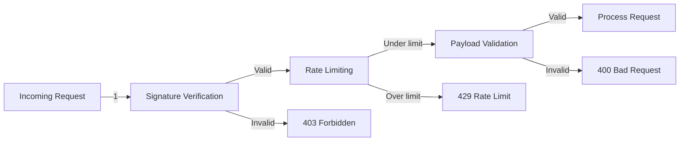

# easyMO Webhook Microservices - Implementation Phases

**Project:** easyMO Platform  
**Project ID:** lhbowpbcpwoiparwnwgt  
**Date:** 2025-11-28  
**Based On:** EASYMO_WEBHOOK_STATUS_REPORT.md

---

## Overview

This document outlines the phased implementation plan to address issues found in the webhook microservices review and improve the overall system.

---

## Phase 1: Critical Security & Stability (Week 1)

**Timeline:** 1 week  
**Priority:** 🔴 CRITICAL  
**Owner:** DevOps + Security Team

### Tasks

#### 1.1 Add Rate Limiting to wa-webhook-core
**Priority:** HIGH  
**Time:** 30 minutes  
**Status:** ⏳ Pending

**Action:**
```typescript
// File: supabase/functions/wa-webhook-core/index.ts
// Add at the beginning of the request handler

import { rateLimitMiddleware } from "../_shared/rate-limit/index.ts";

serve(async (req: Request): Promise<Response> => {
  // Add rate limiting
  const rateLimitCheck = await rateLimitMiddleware(req, {
    limit: 300, // Higher limit for router
    windowSeconds: 60,
    key: 'wa-webhook-core'
  });
  
  if (!rateLimitCheck.allowed) {
    return rateLimitCheck.response!;
  }
  
  // ... rest of the handler
});
```

**Testing:**
- Send 301 requests in 60 seconds
- Verify 301st request returns 429
- Check X-RateLimit headers

**Success Criteria:**
- ✅ Rate limit enforced
- ✅ Proper 429 responses
- ✅ Router protected from DoS

---

#### 1.2 Harden momo-sms-webhook Security
**Priority:** HIGH  
**Time:** 1 hour  
**Status:** ⏳ Pending

**Issues Found:**
- ❌ No signature verification
- ❌ No rate limiting
- ❌ Limited error handling

**Actions:**

**Step 1: Add IP Whitelisting**
```typescript
// File: supabase/functions/momo-sms-webhook/index.ts

const ALLOWED_SMS_GATEWAY_IPS = [
  '196.223.123.45', // Example: SMS gateway IP
  '41.202.XXX.XXX',  // Add actual SMS gateway IPs
];

serve(async (req: Request): Promise<Response> => {
  // IP Whitelisting
  const clientIP = req.headers.get('x-real-ip') || 
                   req.headers.get('x-forwarded-for')?.split(',')[0];
  
  if (!clientIP || !ALLOWED_SMS_GATEWAY_IPS.includes(clientIP)) {
    await logStructuredEvent('sms_webhook.unauthorized_ip', {
      ip: clientIP,
      timestamp: new Date().toISOString()
    });
    return new Response('Forbidden', { status: 403 });
  }
  
  // ... rest of handler
});
```

**Step 2: Add Rate Limiting**
```typescript
// Add after IP check
const rateLimitCheck = await rateLimitMiddleware(req, {
  limit: 100,
  windowSeconds: 60,
  key: clientIP
});

if (!rateLimitCheck.allowed) {
  return rateLimitCheck.response!;
}
```

**Step 3: Improve Error Handling**
```typescript
try {
  // SMS parsing logic
  const parsedTransaction = await parseSMS(smsBody);
  
  // Process transaction
  await processMoMoTransaction(parsedTransaction);
  
  return new Response(JSON.stringify({ status: 'success' }), {
    status: 200,
    headers: { 'Content-Type': 'application/json' }
  });
} catch (err) {
  await logError(err, {
    service: 'momo-sms-webhook',
    smsBody,
    clientIP
  });
  
  return new Response(JSON.stringify({
    error: 'processing_failed',
    message: 'SMS processing failed'
  }), {
    status: 500,
    headers: { 'Content-Type': 'application/json' }
  });
}
```

**Testing:**
- Test with allowed IP → Success
- Test with unknown IP → 403 Forbidden
- Test rate limiting → 429 after threshold
- Test malformed SMS → Error handling

**Success Criteria:**
- ✅ Only allowed IPs can access
- ✅ Rate limiting active
- ✅ Errors handled gracefully
- ✅ All tests passing

---

#### 1.3 End-to-End Testing
**Priority:** HIGH  
**Time:** 2-4 hours  
**Status:** ⏳ Pending

**Test Cases:**

**WhatsApp Flow Testing:**
```bash
# 1. Test wa-webhook-core routing
curl -X POST https://lhbowpbcpwoiparwnwgt.supabase.co/functions/v1/wa-webhook-core \
  -H "Content-Type: application/json" \
  -H "x-hub-signature-256: sha256=..." \
  -d '{
    "entry": [{
      "changes": [{
        "value": {
          "messages": [{
            "from": "+250788123456",
            "text": {"body": "jobs"}
          }]
        }
      }]
    }]
  }'

# Expected: Routes to wa-webhook-jobs, user receives job listings
```

**Test Matrix:**

| Service | Test Message | Expected Response |
|---------|-------------|-------------------|
| wa-webhook-core | "jobs" | Routes to jobs service |
| wa-webhook-jobs | "find jobs" | Job categories list |
| wa-webhook-property | "rent property" | Property types menu |
| wa-webhook-mobility | "book ride" | Request pickup location |
| wa-webhook-marketplace | "shop" | Product categories |

**Payment Webhook Testing:**
```bash
# Test MoMo webhook
curl -X POST https://lhbowpbcpwoiparwnwgt.supabase.co/functions/v1/momo-webhook \
  -H "Content-Type: application/json" \
  -H "x-signature: ..." \
  -d '{
    "transactionId": "TEST123",
    "amount": 5000,
    "currency": "RWF",
    "status": "SUCCESSFUL"
  }'

# Expected: Transaction processed, user notified
```

**Success Criteria:**
- ✅ All routing tests pass
- ✅ Message flows complete end-to-end
- ✅ Payment webhooks process correctly
- ✅ Error scenarios handled
- ✅ Logs show correct flow

---

### Phase 1 Deliverables

- ✅ wa-webhook-core with rate limiting
- ✅ momo-sms-webhook security hardened
- ✅ End-to-end test results documented
- ✅ All critical issues resolved

**Phase 1 Exit Criteria:**
- All services operational with security improvements
- No critical vulnerabilities
- End-to-end flows validated

---

## Phase 2: Code Quality & Reliability (Weeks 2-3)

**Timeline:** 2 weeks  
**Priority:** 🟡 IMPORTANT  
**Owner:** Development Team

### Tasks

#### 2.1 Add Comprehensive Error Boundaries
**Priority:** MEDIUM  
**Time:** 2-3 days  
**Status:** ⏳ Pending

**Services to Update:**
- wa-webhook-jobs
- wa-webhook-marketplace
- wa-webhook-ai-agents
- wa-webhook-insurance
- All payment webhooks

**Implementation Pattern:**

**File Template:**
```typescript
// Create: supabase/functions/_shared/error-handler.ts

export async function withErrorHandler(
  handler: () => Promise<Response>,
  context: {
    service: string;
    requestId: string;
    userId?: string;
  }
): Promise<Response> {
  try {
    return await handler();
  } catch (err) {
    // Log error with context
    await logStructuredEvent('service.error', {
      ...context,
      error: err.message,
      stack: err.stack,
      timestamp: new Date().toISOString()
    });
    
    // Send user-friendly error message
    if (context.userId) {
      try {
        await sendText(
          context.userId,
          "Sorry, something went wrong. Our team has been notified. Please try again later."
        );
      } catch (sendErr) {
        // Log but don't fail
        console.error('Failed to send error notification:', sendErr);
      }
    }
    
    // Return error response
    return new Response(JSON.stringify({
      error: 'internal_error',
      message: 'An unexpected error occurred',
      requestId: context.requestId
    }), {
      status: 500,
      headers: { 'Content-Type': 'application/json' }
    });
  }
}
```

**Usage in Services:**
```typescript
// In wa-webhook-jobs/index.ts
import { withErrorHandler } from "../_shared/error-handler.ts";

serve(async (req: Request): Promise<Response> => {
  const requestId = req.headers.get("x-request-id") ?? crypto.randomUUID();
  
  return withErrorHandler(async () => {
    // Your business logic here
    const result = await processJobRequest(req);
    return result;
  }, {
    service: 'wa-webhook-jobs',
    requestId,
    userId: message.from
  });
});
```

**Success Criteria:**
- ✅ All services have error boundaries
- ✅ Users receive friendly error messages
- ✅ Errors logged with full context
- ✅ Services don't crash on errors

---

#### 2.2 Create Integration Test Suite
**Priority:** MEDIUM  
**Time:** 1 week  
**Status:** ⏳ Pending

**Test Structure:**
```
supabase/functions/__tests__/
├── setup.ts
├── helpers/
│   ├── mock-whatsapp-payload.ts
│   ├── mock-payment-payload.ts
│   └── test-client.ts
├── integration/
│   ├── wa-webhook-core.test.ts
│   ├── wa-webhook-jobs.test.ts
│   ├── wa-webhook-property.test.ts
│   ├── wa-webhook-mobility.test.ts
│   ├── payment-webhooks.test.ts
│   └── end-to-end-flow.test.ts
└── README.md
```

**Example Test:**
```typescript
// File: __tests__/integration/wa-webhook-core.test.ts

import { assertEquals } from "https://deno.land/std@0.168.0/testing/asserts.ts";
import { createWhatsAppPayload } from "../helpers/mock-whatsapp-payload.ts";
import { TestClient } from "../helpers/test-client.ts";

Deno.test("wa-webhook-core: Routes 'jobs' keyword to jobs service", async () => {
  const client = new TestClient();
  
  const payload = createWhatsAppPayload({
    from: "+250788123456",
    text: "jobs"
  });
  
  const response = await client.post('/wa-webhook-core', payload, {
    signature: client.signPayload(payload)
  });
  
  assertEquals(response.status, 200);
  
  // Verify routing happened
  const logs = await client.getLogs('wa-webhook-core');
  assertEquals(logs.some(log => log.message.includes('routing to wa-webhook-jobs')), true);
});

Deno.test("wa-webhook-core: Rejects unsigned webhook", async () => {
  const client = new TestClient();
  
  const payload = createWhatsAppPayload({
    from: "+250788123456",
    text: "test"
  });
  
  // Send without signature
  const response = await client.post('/wa-webhook-core', payload);
  
  assertEquals(response.status, 403);
});

Deno.test("wa-webhook-core: Rate limits after threshold", async () => {
  const client = new TestClient();
  
  const payload = createWhatsAppPayload({
    from: "+250788123456",
    text: "test"
  });
  
  // Send 301 requests
  for (let i = 0; i < 301; i++) {
    const response = await client.post('/wa-webhook-core', payload, {
      signature: client.signPayload(payload)
    });
    
    if (i < 300) {
      assertEquals(response.status, 200);
    } else {
      assertEquals(response.status, 429);
    }
  }
});
```

**Test Coverage Goals:**
- Unit tests: 80%+
- Integration tests: All critical paths
- E2E tests: Main user flows

**Success Criteria:**
- ✅ Test suite runs in CI/CD
- ✅ All tests passing
- ✅ Coverage > 80%
- ✅ Tests document behavior

---

#### 2.3 Decommission Deprecated wa-webhook Service
**Priority:** MEDIUM  
**Time:** 2 hours  
**Status:** ⏳ Pending

**Steps:**

**Step 1: Verify No Traffic (1 day monitoring)**
```sql
-- Query Supabase logs
SELECT 
  COUNT(*) as request_count,
  timestamp::date as date
FROM edge_logs
WHERE path LIKE '%/wa-webhook%'
  AND path NOT LIKE '%/wa-webhook-%'  -- Exclude new services
GROUP BY date
ORDER BY date DESC
LIMIT 7;

-- Expected: 0 requests to old wa-webhook
```

**Step 2: Add Deprecation Notice**
```typescript
// File: supabase/functions/wa-webhook/index.ts
// Add at the top of the handler

serve(async (req: Request): Promise<Response> => {
  // Log deprecation warning
  await logStructuredEvent('deprecated_service.access_attempt', {
    service: 'wa-webhook',
    timestamp: new Date().toISOString(),
    headers: Object.fromEntries(req.headers.entries())
  });
  
  return new Response(JSON.stringify({
    error: 'service_deprecated',
    message: 'This service is deprecated. Please use wa-webhook-core instead.',
    migration: 'https://docs.easymo.com/migration/wa-webhook-core'
  }), {
    status: 410, // Gone
    headers: { 'Content-Type': 'application/json' }
  });
});
```

**Step 3: Undeploy After 7 Days**
```bash
# After confirming 0 traffic for 7 days
cd /Users/jeanbosco/workspace/easymo
supabase functions delete wa-webhook --project-ref lhbowpbcpwoiparwnwgt
```

**Step 4: Archive Code**
```bash
# Move to archive
mkdir -p supabase/functions/.archive/
mv supabase/functions/wa-webhook supabase/functions/.archive/wa-webhook-deprecated-2025-11-28
```

**Success Criteria:**
- ✅ 7 days with zero traffic verified
- ✅ Service undeployed
- ✅ Code archived
- ✅ Documentation updated

---

### Phase 2 Deliverables

- ✅ Error handlers implemented in all services
- ✅ Integration test suite with 80%+ coverage
- ✅ Deprecated service removed
- ✅ Code quality improved

**Phase 2 Exit Criteria:**
- All services have comprehensive error handling
- Automated tests covering critical paths
- No deprecated services running

---

## Phase 3: Monitoring & Observability (Week 4)

**Timeline:** 1-2 weeks  
**Priority:** 🟡 IMPORTANT  
**Owner:** SRE Team

### Tasks

#### 3.1 Set Up Monitoring Dashboard
**Priority:** MEDIUM  
**Time:** 3 days  
**Status:** ⏳ Pending

**Metrics to Track:**

**Service Health:**
- Request rate (per service)
- Error rate (%)
- P50, P95, P99 latency
- Success rate

**Business Metrics:**
- Messages processed (per service)
- Active users (daily, weekly)
- Conversion rates (jobs applied, properties inquired, rides booked)
- Payment success rate

**Infrastructure:**
- Database connections
- Memory usage
- Cold start frequency
- DLQ size

**Implementation:**

**Option 1: Supabase Dashboard + Custom Views**
```sql
-- Create materialized view for metrics
CREATE MATERIALIZED VIEW webhook_metrics AS
SELECT 
  service,
  DATE_TRUNC('hour', timestamp) as hour,
  COUNT(*) as request_count,
  AVG(duration_ms) as avg_latency,
  PERCENTILE_CONT(0.95) WITHIN GROUP (ORDER BY duration_ms) as p95_latency,
  SUM(CASE WHEN status >= 400 THEN 1 ELSE 0 END) as error_count
FROM edge_logs
WHERE service LIKE 'wa-webhook%'
GROUP BY service, hour;

-- Refresh every 5 minutes
CREATE INDEX idx_webhook_metrics_service_hour ON webhook_metrics(service, hour);
```

**Option 2: Grafana + Prometheus**
```yaml
# docker-compose.monitoring.yml
version: '3.8'
services:
  prometheus:
    image: prom/prometheus
    ports:
      - "9090:9090"
    volumes:
      - ./prometheus.yml:/etc/prometheus/prometheus.yml
  
  grafana:
    image: grafana/grafana
    ports:
      - "3001:3000"
    environment:
      - GF_SECURITY_ADMIN_PASSWORD=admin
```

**Dashboard Panels:**
1. Request Rate (per service)
2. Error Rate (%)
3. Latency Distribution
4. Active Sessions
5. DLQ Size
6. Top Errors

**Success Criteria:**
- ✅ Dashboard accessible
- ✅ All metrics visible
- ✅ Real-time updates
- ✅ Historical data retained

---

#### 3.2 Configure Alerts
**Priority:** MEDIUM  
**Time:** 2 days  
**Status:** ⏳ Pending

**Alert Rules:**

**Critical Alerts (PagerDuty):**
```yaml
alerts:
  - name: service_down
    condition: error_rate > 50% for 5 minutes
    severity: critical
    channels: [pagerduty, slack]
    
  - name: high_latency
    condition: p95_latency > 3000ms for 10 minutes
    severity: critical
    channels: [pagerduty, slack]
    
  - name: dlq_overflow
    condition: dlq_size > 1000
    severity: critical
    channels: [pagerduty, slack]
```

**Warning Alerts (Slack only):**
```yaml
  - name: elevated_error_rate
    condition: error_rate > 5% for 15 minutes
    severity: warning
    channels: [slack]
    
  - name: slow_response
    condition: p95_latency > 1500ms for 15 minutes
    severity: warning
    channels: [slack]
    
  - name: dlq_growth
    condition: dlq_size > 100
    severity: warning
    channels: [slack]
```

**Implementation:**
```typescript
// Create: supabase/functions/alert-checker/index.ts
// Scheduled to run every 5 minutes

import { createClient } from "@supabase/supabase-js";

const ALERT_RULES = [
  {
    name: 'high_error_rate',
    query: `
      SELECT 
        service,
        COUNT(*) FILTER (WHERE status >= 400)::FLOAT / COUNT(*) as error_rate
      FROM edge_logs
      WHERE timestamp > NOW() - INTERVAL '5 minutes'
      GROUP BY service
      HAVING COUNT(*) FILTER (WHERE status >= 400)::FLOAT / COUNT(*) > 0.5
    `,
    severity: 'critical',
    message: (row) => `🚨 Critical: ${row.service} has ${(row.error_rate * 100).toFixed(2)}% error rate`
  }
];

serve(async () => {
  const supabase = createClient(/* ... */);
  
  for (const rule of ALERT_RULES) {
    const { data } = await supabase.rpc('run_sql', { query: rule.query });
    
    if (data && data.length > 0) {
      // Send alert
      await sendAlert({
        severity: rule.severity,
        message: rule.message(data[0]),
        service: data[0].service
      });
    }
  }
  
  return new Response('OK');
});
```

**Success Criteria:**
- ✅ Alerts trigger correctly
- ✅ Notifications received in Slack/PagerDuty
- ✅ False positive rate < 5%
- ✅ Alert fatigue minimized

---

#### 3.3 Enhanced Logging
**Priority:** MEDIUM  
**Time:** 2 days  
**Status:** ⏳ Pending

**Structured Logging Standard:**
```typescript
// Update: supabase/functions/_shared/observability.ts

export interface LogEvent {
  timestamp: string;
  service: string;
  level: 'debug' | 'info' | 'warn' | 'error' | 'fatal';
  event: string;
  requestId: string;
  correlationId: string;
  userId?: string;
  duration?: number;
  metadata?: Record<string, unknown>;
}

export async function logStructuredEvent(
  event: string,
  metadata: Record<string, unknown>,
  level: LogEvent['level'] = 'info'
) {
  const logEntry: LogEvent = {
    timestamp: new Date().toISOString(),
    service: metadata.service as string,
    level,
    event,
    requestId: metadata.requestId as string,
    correlationId: metadata.correlationId as string,
    userId: metadata.userId as string,
    duration: metadata.duration as number,
    metadata
  };
  
  // Log to console (Supabase captures)
  console.log(JSON.stringify(logEntry));
  
  // Optional: Send to external log aggregator
  if (Deno.env.get('LOG_AGGREGATOR_URL')) {
    await fetch(Deno.env.get('LOG_AGGREGATOR_URL')!, {
      method: 'POST',
      headers: { 'Content-Type': 'application/json' },
      body: JSON.stringify(logEntry)
    }).catch(err => console.error('Failed to send to log aggregator:', err));
  }
}
```

**Log Retention Policy:**
- Hot logs (searchable): 7 days
- Warm logs (archived): 30 days
- Cold logs (S3): 1 year

**Success Criteria:**
- ✅ All services use structured logging
- ✅ Logs searchable and filterable
- ✅ Retention policy enforced
- ✅ Log aggregation working

---

### Phase 3 Deliverables

- ✅ Monitoring dashboard operational
- ✅ Alerts configured and tested
- ✅ Enhanced logging implemented
- ✅ SRE runbooks created

**Phase 3 Exit Criteria:**
- Real-time visibility into system health
- Proactive alerting for issues
- Comprehensive logs for debugging

---

## Phase 4: Performance & Optimization (Weeks 5-7)

**Timeline:** 2-3 weeks  
**Priority:** 🟢 NICE TO HAVE  
**Owner:** Performance Team

### Tasks

#### 4.1 Database Query Optimization
**Priority:** LOW  
**Time:** 1 week  
**Status:** ⏳ Pending

**Analysis:**
```sql
-- Find slow queries
SELECT 
  query,
  calls,
  total_time,
  mean_time,
  max_time
FROM pg_stat_statements
WHERE mean_time > 100  -- > 100ms average
ORDER BY mean_time DESC
LIMIT 20;
```

**Optimization Strategies:**

**1. Add Missing Indexes:**
```sql
-- Example: Jobs search
CREATE INDEX CONCURRENTLY idx_jobs_location_category 
ON jobs(location, category) 
WHERE status = 'active';

CREATE INDEX CONCURRENTLY idx_jobs_posted_at 
ON jobs(posted_at DESC) 
WHERE status = 'active';
```

**2. Optimize N+1 Queries:**
```typescript
// Before (N+1):
const jobs = await supabase.from('jobs').select('*');
for (const job of jobs) {
  const employer = await supabase.from('employers').select('*').eq('id', job.employer_id);
}

// After (1 query):
const { data: jobs } = await supabase
  .from('jobs')
  .select(`
    *,
    employer:employers(*)
  `);
```

**3. Add Database Caching:**
```typescript
// Create Redis cache layer
import { Redis } from "https://deno.land/x/redis/mod.ts";

const redis = await Redis.connect({
  hostname: Deno.env.get('REDIS_HOST'),
  port: 6379
});

async function getCachedJobs(location: string, category: string) {
  const cacheKey = `jobs:${location}:${category}`;
  
  // Try cache first
  const cached = await redis.get(cacheKey);
  if (cached) {
    return JSON.parse(cached);
  }
  
  // Query database
  const { data: jobs } = await supabase
    .from('jobs')
    .select('*')
    .eq('location', location)
    .eq('category', category);
  
  // Cache for 5 minutes
  await redis.setex(cacheKey, 300, JSON.stringify(jobs));
  
  return jobs;
}
```

**Success Criteria:**
- ✅ P95 query time < 50ms
- ✅ No N+1 queries
- ✅ Cache hit rate > 70%
- ✅ Database CPU < 50%

---

#### 4.2 Response Time Optimization
**Priority:** LOW  
**Time:** 1 week  
**Status:** ⏳ Pending

**Targets:**
- P50 latency: < 500ms
- P95 latency: < 1200ms
- P99 latency: < 2000ms

**Strategies:**

**1. Reduce Cold Starts:**
```typescript
// Implement keep-alive ping
// Create: supabase/functions/keep-alive-pinger/index.ts

const SERVICES_TO_PING = [
  'wa-webhook-core',
  'wa-webhook-jobs',
  'wa-webhook-property',
  'wa-webhook-mobility'
];

serve(async () => {
  const results = await Promise.all(
    SERVICES_TO_PING.map(service =>
      fetch(`https://lhbowpbcpwoiparwnwgt.supabase.co/functions/v1/${service}/health`)
        .then(r => ({ service, status: r.status }))
        .catch(err => ({ service, error: err.message }))
    )
  );
  
  return new Response(JSON.stringify(results));
});

// Schedule: Every 5 minutes via pg_cron
```

**2. Optimize Payload Size:**
```typescript
// Reduce WhatsApp response payload size
function buildJobListMessage(jobs: Job[]) {
  return {
    type: 'list',
    body: {
      text: `Found ${jobs.length} jobs`
    },
    action: {
      sections: [{
        rows: jobs.slice(0, 10).map(job => ({
          id: job.id,
          title: job.title.substring(0, 24), // WhatsApp limit
          description: `${job.salary} | ${job.location}`.substring(0, 72)
          // Remove unnecessary fields
        }))
      }]
    }
  };
}
```

**3. Parallel Processing:**
```typescript
// Execute independent operations in parallel
const [user, jobs, savedSearches] = await Promise.all([
  getUserProfile(userId),
  getJobs(filters),
  getSavedSearches(userId)
]);
```

**Success Criteria:**
- ✅ Cold start < 1000ms
- ✅ P95 latency < 1200ms
- ✅ Payload size optimized
- ✅ Parallel processing where applicable

---

#### 4.3 Resource Optimization
**Priority:** LOW  
**Time:** 3 days  
**Status:** ⏳ Pending

**Memory Optimization:**
```typescript
// Use streaming for large responses
async function streamLargeDataset(data: AsyncIterator<any>) {
  const encoder = new TextEncoder();
  
  return new Response(
    new ReadableStream({
      async start(controller) {
        for await (const item of data) {
          controller.enqueue(encoder.encode(JSON.stringify(item) + '\n'));
        }
        controller.close();
      }
    }),
    {
      headers: { 'Content-Type': 'application/x-ndjson' }
    }
  );
}
```

**Connection Pool Optimization:**
```typescript
// Configure Supabase client with connection pooling
const supabase = createClient(
  Deno.env.get('SUPABASE_URL')!,
  Deno.env.get('SUPABASE_SERVICE_ROLE_KEY')!,
  {
    db: {
      schema: 'public',
      poolerMode: 'transaction', // Use transaction pooling
    },
    auth: {
      persistSession: false, // Don't persist in Edge Functions
    }
  }
);
```

**Success Criteria:**
- ✅ Memory usage optimized
- ✅ Connection pool efficient
- ✅ No memory leaks
- ✅ Resource usage < 50% average

---

### Phase 4 Deliverables

- ✅ Database queries optimized
- ✅ Response times improved
- ✅ Resources efficiently utilized
- ✅ Performance benchmarks documented

**Phase 4 Exit Criteria:**
- P95 latency < 1200ms
- Database performance improved
- Resource usage optimized

---

## Phase 5: Documentation & Knowledge Transfer (Week 8)

**Timeline:** 1 week  
**Priority:** 🟢 NICE TO HAVE  
**Owner:** Technical Writers + Engineering

### Tasks

#### 5.1 Create Architecture Diagrams
**Priority:** LOW  
**Time:** 2 days  
**Status:** ⏳ Pending

**Diagrams to Create:**

**1. System Architecture:**


**2. Message Flow:**


**3. Security Flow:**


**Tools:** Mermaid, Lucidchart, or draw.io

**Success Criteria:**
- ✅ All major flows documented
- ✅ Diagrams in version control
- ✅ Embedded in documentation

---

#### 5.2 Write API Documentation
**Priority:** LOW  
**Time:** 2 days  
**Status:** ⏳ Pending

**Documentation Structure:**
```markdown
# easyMO Webhook API Documentation

## wa-webhook-core

### Endpoint
POST https://lhbowpbcpwoiparwnwgt.supabase.co/functions/v1/wa-webhook-core

### Authentication
- HMAC-SHA256 signature in `x-hub-signature-256` header
- No JWT required (verify_jwt: false)

### Request Format
```json
{
  "object": "whatsapp_business_account",
  "entry": [{
    "changes": [{
      "value": {
        "messages": [{
          "from": "+250788123456",
          "id": "wamid.xxx",
          "timestamp": "1234567890",
          "type": "text",
          "text": {
            "body": "jobs"
          }
        }]
      }
    }]
  }]
}
```

### Response Format
```json
{
  "status": "success",
  "routed_to": "wa-webhook-jobs"
}
```

### Error Responses
- `403 Forbidden`: Invalid signature
- `429 Too Many Requests`: Rate limit exceeded
- `500 Internal Server Error`: Processing failed

### Rate Limits
- 300 requests per minute per IP
```

**Success Criteria:**
- ✅ All endpoints documented
- ✅ Examples included
- ✅ Error codes documented
- ✅ Authentication explained

---

#### 5.3 Create Runbooks
**Priority:** LOW  
**Time:** 2 days  
**Status:** ⏳ Pending

**Runbook Topics:**

**1. Deployment Runbook:**
```markdown
# Deployment Runbook

## Pre-deployment Checklist
- [ ] Code reviewed and approved
- [ ] Tests passing
- [ ] Secrets configured
- [ ] Backup database

## Deployment Steps
1. Deploy to staging
   ```bash
   cd /Users/jeanbosco/workspace/easymo
   ./deploy_wa_services.sh wa-webhook-jobs
   ```
2. Run smoke tests
3. Monitor logs for 10 minutes
4. Deploy to production
5. Monitor metrics

## Rollback Procedure
1. Identify last good version
2. Redeploy previous version
3. Verify functionality
4. Investigate issue
```

**2. Incident Response Runbook:**
```markdown
# Incident Response Runbook

## High Error Rate Alert

### Triage
1. Check Supabase dashboard for error logs
2. Identify affected service
3. Check recent deployments

### Investigation
```sql
SELECT 
  error_message,
  COUNT(*) as count
FROM edge_logs
WHERE service = 'wa-webhook-jobs'
  AND status >= 400
  AND timestamp > NOW() - INTERVAL '1 hour'
GROUP BY error_message
ORDER BY count DESC;
```

### Resolution
- If deployment issue: Rollback
- If database issue: Check connections
- If external API: Check service status

### Communication
- Update status page
- Notify in #incidents Slack channel
- Send email to stakeholders
```

**Success Criteria:**
- ✅ Runbooks cover common scenarios
- ✅ Clear step-by-step instructions
- ✅ Accessible to on-call team

---

#### 5.4 Knowledge Transfer Sessions
**Priority:** LOW  
**Time:** 1 day  
**Status:** ⏳ Pending

**Sessions:**

**Session 1: Architecture Overview (1 hour)**
- System architecture
- Service responsibilities
- Communication patterns
- Database schema

**Session 2: Operations (1 hour)**
- Deployment process
- Monitoring and alerts
- Log analysis
- Incident response

**Session 3: Development (1 hour)**
- Codebase structure
- Shared utilities
- Testing approach
- Best practices

**Session 4: Q&A (30 minutes)**
- Open questions
- Edge cases
- Future improvements

**Deliverables:**
- ✅ Session recordings
- ✅ Slide decks
- ✅ Q&A document
- ✅ Team trained

---

### Phase 5 Deliverables

- ✅ Architecture diagrams
- ✅ API documentation
- ✅ Operational runbooks
- ✅ Team trained

**Phase 5 Exit Criteria:**
- Documentation complete and accessible
- Team confident in operations
- Knowledge transferred

---

## Phase 6: Future Enhancements (Ongoing)

**Timeline:** Ongoing  
**Priority:** 🟢 BACKLOG  
**Owner:** Product + Engineering

### Potential Features

#### 6.1 Rich Media Support
**Description:** Support images, videos, documents in WhatsApp messages

**Implementation:**
- Media upload handling
- Storage integration (S3/Supabase Storage)
- Thumbnail generation
- CDN integration

**Business Value:** Enhanced user experience

---

#### 6.2 Template Messages
**Description:** Pre-approved template messages for notifications

**Implementation:**
- Template management system
- Variable substitution
- Approval workflow
- Multi-language support

**Business Value:** Faster notifications, Meta compliance

---

#### 6.3 Group Messaging
**Description:** Support WhatsApp group interactions

**Implementation:**
- Group message handling
- Member management
- Admin commands
- Broadcast lists

**Business Value:** Community features, announcements

---

#### 6.4 Voice Messages
**Description:** Handle voice message inputs

**Implementation:**
- Audio transcription (Whisper API)
- Voice command processing
- Audio storage
- Playback support

**Business Value:** Accessibility, convenience

---

#### 6.5 Payment Integration Expansion
**Description:** Add more payment methods

**Options:**
- Stripe
- PayPal
- Local payment gateways
- Cryptocurrency

**Business Value:** More payment options, increased conversions

---

## Implementation Timeline Summary

```
Week 1:   Phase 1 - Critical Security & Stability
Weeks 2-3: Phase 2 - Code Quality & Reliability
Week 4:   Phase 3 - Monitoring & Observability
Weeks 5-7: Phase 4 - Performance & Optimization
Week 8:   Phase 5 - Documentation & Knowledge Transfer
Ongoing:  Phase 6 - Future Enhancements
```

---

## Success Metrics

### Phase 1 (Week 1)
- ✅ 0 critical security issues
- ✅ All services have rate limiting
- ✅ End-to-end tests passing

### Phase 2 (Weeks 2-3)
- ✅ Error rate < 1%
- ✅ Test coverage > 80%
- ✅ 0 deprecated services

### Phase 3 (Week 4)
- ✅ Mean time to detection < 5 minutes
- ✅ Mean time to resolution < 30 minutes
- ✅ Alert accuracy > 95%

### Phase 4 (Weeks 5-7)
- ✅ P95 latency < 1200ms
- ✅ Database CPU < 50%
- ✅ Memory usage optimized

### Phase 5 (Week 8)
- ✅ 100% documentation coverage
- ✅ Team trained
- ✅ Runbooks complete

---

## Risk Management

### Risks & Mitigation

**Risk 1: Production Impact During Phase 1**
- **Mitigation:** Deploy during low-traffic hours
- **Rollback:** Keep previous versions ready

**Risk 2: Test Coverage Gaps in Phase 2**
- **Mitigation:** Start with critical paths
- **Fallback:** Manual testing for edge cases

**Risk 3: Alert Fatigue in Phase 3**
- **Mitigation:** Start with high thresholds, tune down
- **Monitoring:** Track alert-to-incident ratio

**Risk 4: Performance Regression in Phase 4**
- **Mitigation:** Benchmark before and after
- **Rollback:** Revert optimizations if needed

---

## Conclusion

This phased implementation plan addresses all issues found in the webhook microservices review while minimizing risk and ensuring continuous operation.

**Key Principles:**
- Safety first (no breaking changes)
- Incremental improvements
- Continuous validation
- Team involvement
- Documentation throughout

**Next Steps:**
1. Review and approve this plan
2. Assign team members to phases
3. Set up project tracking (Jira/GitHub Projects)
4. Begin Phase 1

---

**Document Version:** 1.0  
**Last Updated:** 2025-11-28  
**Status:** Ready for Review  
**Owner:** Engineering Team
