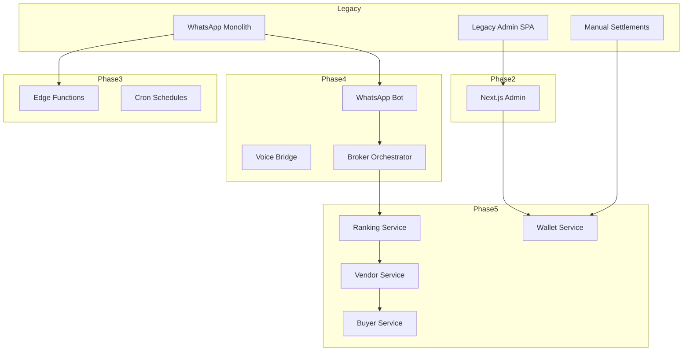

# Phase 5 Cutover Runbook

This runbook consolidates the surface inventory, feature flag catalogue, staged enablement plan, rollback drills, and go-live checklist required to transition EasyMO from the legacy experience (Phase 0) through the new marketplace stack (Phase 5).

## 1. Phase 0–5 Surface Inventory

### 1.1 Comparative map

| Phase | Legacy surfaces | New / target surfaces | Primary owners | Notes |
| --- | --- | --- | --- | --- |
| Phase 0 – Baseline | WhatsApp monolith (`supabase/functions/wa-webhook/*`), Vite admin SPA (`src/`) | N/A – Legacy only | Ops + Supabase | Captured in `docs/go-live-readiness.md`; focuses on stabilising existing flows and data exports.【F:docs/go-live-readiness.md†L1-L70】 |
| Phase 1 – Foundations | Legacy WhatsApp router, legacy admin SPA | Environment alignment (`docs/env/*`), Supabase config parity (`supabase/config.toml`), secrets rotation | DevOps | Hardens auth + environment parity; still serves legacy surfaces during validation.【F:docs/go-live-readiness.md†L14-L59】 |
| Phase 2 – Admin foundations | Legacy admin SPA | Next.js admin app (`admin-app`), shared route helpers (`packages/shared/src/routes`) | Admin platform | Both SPAs run behind feature flags while parity validation happens.【F:docs/application-inventory.md†L9-L31】 |
| Phase 3 – Edge + cron | Legacy WhatsApp router | Supabase Edge functions (`supabase/functions/*`), cron schedules, secrets alignment | Platform | Enables read-only agent APIs + scheduled jobs.【F:docs/go-live-readiness.md†L61-L128】 |
| Phase 4 – Realtime bridges | Legacy WhatsApp router | Voice bridge, SIP ingress, WhatsApp bot, broker orchestrator (`docs/phase4/OVERVIEW.md`) | Messaging + voice | Introduces Kafka/Redis-backed ingestion with agent-core orchestration.【F:docs/phase4/OVERVIEW.md†L1-L40】 |
| Phase 5 – Marketplace stack | Legacy vouchers + manual settlements | Wallet, ranking, vendor, buyer services (`docs/phase5/OVERVIEW.md`) | Marketplace + finance | Activates double-entry ledger and marketplace intents-to-purchase flows.【F:docs/phase5/OVERVIEW.md†L1-L48】 |

### 1.2 Surface diagram

### 1.3 Feature flag catalogue by domain

| Domain | Flags | Scope | Default | Source |
| --- | --- | --- | --- | --- |
| Agent-facing surfaces | `FEATURE_AGENT_CHAT`, `FEATURE_AGENT_WEB_SEARCH`, `FEATURE_AGENT_VOICE`, `FEATURE_AGENT_VOUCHERS`, `FEATURE_AGENT_CUSTOMER_LOOKUP`, `FEATURE_AGENT_COLLECTPAYMENT`, `FEATURE_AGENT_WARMTRANSFER` | Supabase Edge functions, Agent Core service | Off in production until staged rollouts conclude | `config/featureFlags.ts`, `services/agent-core/src/config/configuration.ts`, `supabase/functions/ai-*.ts`【F:config/featureFlags.ts†L14-L33】【F:services/agent-core/src/config/configuration.ts†L20-L27】【F:supabase/functions/ai-whatsapp-webhook/index.ts†L304-L305】 |
| Marketplace services | `FEATURE_WALLET_SERVICE`, `FEATURE_MARKETPLACE_RANKING`, `FEATURE_MARKETPLACE_VENDOR`, `FEATURE_MARKETPLACE_BUYER` | Wallet, ranking, vendor, buyer APIs | Disabled until cutover | `docs/phase5/OVERVIEW.md`, `docker-compose.agent-core.yml` env sections【F:docs/phase5/OVERVIEW.md†L24-L32】【F:docker-compose.agent-core.yml†L90-L197】 |
| Admin web app | `FEATURE_FLAG_DUALCONSTRAINTMATCHING_ENABLED`, `FEATURE_FLAG_BASKET_CONFIRMATION_ENABLED` | Next.js admin routes | Managed per environment | `admin-app/lib/server/feature-flags.ts`【F:admin-app/lib/server/feature-flags.ts†L8-L16】 |
| WhatsApp domains | `motor_insurance` gate, `deeplinks.enabled`, `favorites.enabled`, `recurring_trips.enabled`, `broker.favorites_match.enabled` | Supabase functions + settings table | Data-driven | `supabase/functions/wa-webhook/domains/insurance/gate.ts`, `docs/flags.md`【F:supabase/functions/wa-webhook/domains/insurance/gate.ts†L8-L83】【F:docs/flags.md†L38-L123】 |
| Observability & rollout | `FEATURE_AGENTS_*` toggles for booking/redeem/triage, LaunchDarkly segments | Agent orchestration + experiments | Disabled pending approval | `docs/OPENAI_AGENTS_SUMMARY.md`, `packages/agents/src/feature-flags.ts`【F:docs/OPENAI_AGENTS_SUMMARY.md†L215-L267】【F:packages/agents/src/feature-flags.ts†L31-L45】 |

## 2. Staged enablement plan (non-production)

| Stage | Required toggles | Entry checklist | Metrics to capture | Exit / promotion criteria |
| --- | --- | --- | --- | --- |
| 0. Foundations | All new flags = off; ensure env parity | - Supabase migrations applied to staging - Secrets synced across Supabase, Vercel, GitHub Actions | - Migration runtime vs baseline - Error rate on legacy flows | ✅ `pnpm lint`, `pnpm test`, and Supabase `db diff` clean; legacy flow error rate ≤ baseline +5%. |
| 1. Read-only APIs | `FEATURE_AGENT_CHAT=1`, `FEATURE_AGENT_VOICE=0`, marketplace flags off | - Deploy Edge functions in read-only mode - Configure dashboards (`dashboards/phase4/*.json`) | - Latency p95 for read-only endpoints - 5xx rate per endpoint | Promote once p95 < 400 ms and 5xx < 0.5% for 24 h. |
| 2. Admin PWA read-only | Enable admin feature flags in staging only | - Run Lighthouse on `/admin` routes - Confirm Next.js admin uses read-only APIs | - Lighthouse perf/accessibility scores - Admin API read volume | Promote when Lighthouse ≥ 90/90/90 and zero write attempts detected. |
| 3. Mutations | Enable marketplace flags sequentially (`FEATURE_WALLET_SERVICE`, `FEATURE_MARKETPLACE_VENDOR`, `FEATURE_MARKETPLACE_BUYER`, `FEATURE_MARKETPLACE_RANKING`) | - Run contract tests per service (`pnpm --filter @easymo/*-service test`) - Execute seed fixtures | - Ledger balance delta vs expected - Kafka consumer lag - Error budgets | Promote when end-to-end test suite passes twice consecutively and ledger delta ≤ ₵0.01. |
| 4. Router switch | `ROUTER_ENABLED` points to new orchestrator; agent toggles on | - Toggle LaunchDarkly segment to reroute 5% traffic - Monitor voice + WhatsApp concurrency | - WhatsApp session success rate - Voice bridge MOS proxy | Complete when success rate ≥ 98% for 48 h with no regression in MOS proxy. |

Capture metrics in `dashboards/phase4/*.json` and Supabase logs, and append screenshots or exports to `/docs/phase5/metrics/` per gate.

## 3. Rollback drills & sign-off

1. **Immediate reversion** – toggle flags off in reverse order:
   - Router switch: set `ROUTER_ENABLED=false` (falls back to legacy webhook).【F:docs/flags.md†L60-L75】
   - Marketplace stack: set `FEATURE_MARKETPLACE_*` and `FEATURE_WALLET_SERVICE` to `0` (services reject writes).【F:docs/phase5/OVERVIEW.md†L24-L32】
   - Agent capabilities: disable `FEATURE_AGENT_*` toggles via Supabase secrets and redeploy edge functions.【F:config/featureFlags.ts†L14-L33】

2. **Data protection** – run `scripts/export-ledger.sh` and `scripts/export-router-state.sh` (add `scp` to archive). Ensure in-flight jobs drain before re-enabling legacy flows.

3. **Rehearsal cadence** – schedule monthly tabletop with on-call engineers, agent-core owner, marketplace owner. Track outcomes in the sign-off table below and store Zoom recordings in `/docs/phase5/rollback-drills/`.

| Drill date | Scenario | Participants | Outcome | Follow-ups |
| --- | --- | --- | --- | --- |
| _(fill)_ | Router regression | _(fill)_ | _(fill)_ | _(fill)_ |
| _(fill)_ | Ledger imbalance | _(fill)_ | _(fill)_ | _(fill)_ |

4. **Documentation** – append drill notes to `docs/runbooks/` and update `ROLLBACK_PLAYBOOK.md` if the procedures change. Capture sign-off approvals from each discipline (Engineering, Product, Operations) in the table below.

| Discipline | Approver | Date | Notes |
| --- | --- | --- | --- |
| Engineering | _(fill)_ | _(fill)_ | _(fill)_ |
| Product | _(fill)_ | _(fill)_ | _(fill)_ |
| Operations | _(fill)_ | _(fill)_ | _(fill)_ |

## 4. Go-live checklist

Use this list during the final readiness review. Update statuses directly in this document and link evidence in parentheses.

- [ ] Supabase migrations applied to production (`supabase db push` + migration IDs logged).【F:docs/go-live-readiness.md†L86-L133】
- [ ] Seed scripts executed with idempotent replay confirmation (`supabase/seed/fixtures/*`).
- [ ] GitHub Actions CI green on `main` (link latest run).【F:docs/go-live-readiness.md†L1-L13】
- [ ] Vercel production build succeeded and includes admin app + router toggle context.
- [ ] Lighthouse reports ≥ 90 for performance, accessibility, best practices on `/admin`, `/admin/leads`, `/admin/marketplace`.
- [ ] Observability: Grafana dashboards imported (`dashboards/phase4/*.json`) and alert rules firing to on-call channel.
- [ ] Incident response: `ROLLBACK_PLAYBOOK.md` reviewed, drills signed off, pager escalation tree updated.
- [ ] Supabase storage buckets validated; backups scheduled post-cutover (`docs/go-live-readiness.md` outstanding tasks).【F:docs/go-live-readiness.md†L104-L133】
- [ ] Router switch plan approved (LaunchDarkly change request + rollback instructions).
- [ ] Stakeholder go/no-go sign-off captured (Engineering, Product, Operations).

## 5. Artefact storage

- Inventory exports: `/docs/phase5/metrics/inventory-<date>.xlsx`
- Metrics snapshots per gate: `/docs/phase5/metrics/stage-<n>-<date>.png`
- Drill recordings & notes: `/docs/phase5/rollback-drills/`
- Final go-live evidence bundle: `/docs/phase5/cutover-proof/<date>/`

Keep this runbook version-controlled and update checkboxes + tables as gates complete.
