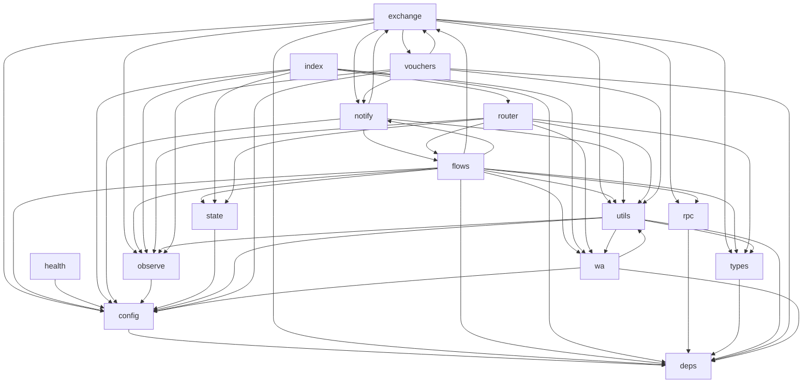

# WA Webhook Bundle Map (Phase 0)

## Module Inventory
| Module | Files | Representative entrypoints |
|--------|-------|----------------------------|
| `exchange` | 35 | exchange/actions/cust_bar_browser.ts, exchange/actions/cust_bar_menu.ts, exchange/actions/cust_order_tracker.ts |
| `flows` | 29 | flows/admin/actions.ts, flows/admin/auth.ts, flows/admin/commands.ts |
| `utils` | 14 | utils/app_config.ts, utils/confirm.ts, utils/geo.ts |
| `router` | 7 | router/guards.ts, router/interactive_button.ts, router/interactive_list.ts |
| `rpc` | 6 | rpc/baskets.ts, rpc/dinein.ts, rpc/marketplace.ts |
| `notify` | 3 | notify/hooks.ts, notify/sender.test.ts, notify/sender.ts |
| `wa` | 3 | wa/client.ts, wa/ids.ts, wa/verify.ts |
| `observe` | 2 | observe/log.ts, observe/metrics.ts |
| `state` | 2 | state/idempotency.ts, state/store.ts |
| `vouchers` | 2 | vouchers/render.ts, vouchers/service.ts |
| `config` | 1 | config.ts |
| `deps` | 1 | deps.ts |
| `health` | 1 | health.ts |
| `index` | 1 | index.ts |
| `types` | 1 | types.ts |

## High-level Dependency Graph

> Each node groups files by the first directory segment under `supabase/functions/wa-webhook`. Root-level files are named after their base filename.
